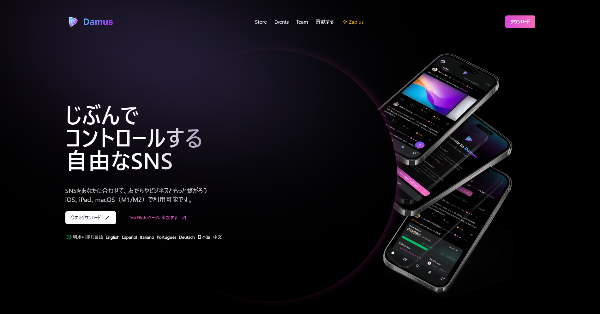

# Bitcoin, Web3, I and Nostr
The first draft of this text was published on [Yakihonne](https://yakihonne.com/article/naddr1qq2hgdfe09a9v3nhvae5jaz8v56yjepkvdm4yq3qm78s5eqv8l7snc5nnxdvlgue6pt5epgplndtem99quhwyptas7jsxpqqqp65w5c0e84) in Japanese.

## At the begining
I believe the approximate time is correct, but the exact time is quite fuzzy, so this text may be the megalomania of a middle-aged man. Note that if anyone who knows me reads this text, they will realize who I am. Even if you find out, please leave me alone and think I'm bored.

## Meeting and saying goodbye to bitcoin
I first owned bitcoin when I met Coincheck (then known as Rejepress), between 2012 and 2014.

I worked for venture capital at the time. Venture capital invest in fast-growing start-ups and then gain profit when the company goes public or is acquired.

There are many factors for a fast-growing, but essential one is that the market the company is targeting must be growing rapidly.

Back then, news of the Mt. Gox hack was on TV, and bitcoin and other virtual currencies (before they were called cryptocurrencies) were becoming known to innovators and beyond.

It was a time when had the opportunity to meet the CEO, Mr Wada, just as I was thinking about investing in an exchange that would be the gateway to bitcoin, with the growth of Zaif and Bitflyer at my side. I asked him to let me invest in Coinchek during a private moment. I would like to thank Mr. Wada once again.

As a associate, I had no authority to make investment decisions, so I needed to submit a propsal to the investment comittee. As part of my preparation, I opened a Coincheck account and, with some nervousness, made my first bitcoin purchase.

After deliberation by committee, the investment opportunity was abandoned (Coincheck has since grown into something of a YAMATANO-OROCHI, not a unicorn) and I was left with nothing but bitcoins.

Despite my disappointment, bitcoin's market capitalisation has continued to grow and it has made a meme such as "just sleep and wake up in the morning to find your money growing".

Then, as a historic event, there was a NEM (XEM) leak at Coincheck that was unprecedented in the world.

At that time, I had already left VC, but while working on a new business there, I asked Mr. Otsuka, who was a director of Coincheck, if he could provide an OEM cryptocurrency exchange. I still remember the people gathering outside his office and the press conference where he was relentlessly denounced.

While I was rooting for Coincheck in the midst of all this, it is also true that I was disappointed by the vulnerability of the exchange as a gateway to bitcoin. If a bullet train tunnel or station can easily collapse, it can no longer be a major artery.

I closed all my positions at that point, withdrew my Japanese yen, and closed my account. By then I had made enough profit to say goodbye to bitcoin with no regrets.

## Hopes and disappointments with Web3
About 3 years later, I was in New Zealand when I was approached by a group of young entrepreneurs.

"Web3, DAOs, smart contracts?"

I'd been away from VC and cryptocurrency for a while, so it was hard to digest all the information I hadn't caught up with, but I thought about what it could mean for the future (not to mention the 3 guys who would go on to found [Fracton Ventures]((https://fracton.ventures/en/about))) and felt hopeful about the system they were betting their lives on.

That discussion recall me the memory of talking to Mr. Mesaki gave me hope. He is the author of 'Nippon, a Happy Developing Country - Proposals to Reborn as a New Nation'. Despite his busy weekday lunchtime schedule, Mr. Mesaki spent over an hour with me. (Mr. K introduced me to Mr. Mesaki and suggested that I meet him before leaving Japan. Thank you very much)

> Autonomy has a correlation with happiness that is 20x greater than the correlation between income and happiness.

Smart contracts ensure transparency and fairness (not equality) by allowing anyone to objectively verify them. They are used as rules by DAOs, where everyone voluntarily contributes to the organization.

It is not easy to change the country you live in, and therefore not easy to change the culture you live in. What if we could pursue happiness by participating in DAOs online?

Unfortunately, Web3 did not turn out as I had imagined.

I won't list every case, but my conclusion is that humanity is not ready for Web3. I hope that one day Web3 and its peripheral technologies will aim to be the best solution to problems that do exist, and that the ideals of the DAO will be realized as they should be.

## Dive in to the rabbit hole
In March 2021, I returned to Japan, leaving my family behind. I had much free time so I do SNS. However Twitter, Facebook and Instagram have already become spaces that resemble the real world with the arrival of the late majority

"Isn't that something?"

Then I was lucky to join [Bluesky](https://bsky.app/), a decentralised SNS via Waitlist. I was enjoying the early Twitter-like space, for innovators and early adopters only, when I noticed a group of active people talking about something called Nostr.

I searched for the word [Nostr](https://nostr.com/) and found [Damus](https://damus.io/), another SNS where Japanese people are active, so I thought I'd check it out.

I fell into the muddy waters of Chinese spam and was pulled back to shore, where I am now.

## Reuniting with bitcoin and expectations
Although I have several social networking accounts, I now primarily use Nostr.

I prefer Nostr because of its innovative and early adopter user base, as well as its Zap system, which uses bitcoin (Lightning network) for transactions.

"Long time no see, bitcoin!"

Additionally, I see great potential in Nostr as a higher level of bitcoin.

Bitcoin's value, like any other legal tender, is based on people's trust in it. Some people criticize it for being virtual and fictional, but to me, its value feels much more plausible than the value of a start-up determined by a few VCs. The fact that so many people across borders trust it as if it were a 'lingua franca of humanity' is romantic.

On Nostr, exchanging value and sentiment with Zap is similar to the crowdfunding exchange of capital with sentiment.

The combination of Nostr's and Bitcoin's systems cannot be altered by third parties. Communication is imbued with a sense of value, and the OSS culture encourages each participant to contribute. This once again demonstrates the dream of voluntary and independent action, leading to happiness, that we first saw in Web3 and DAO.

## In the end
I'm dreaming about Nostr now, but maybe in 6 months I'll be disappointed, or maybe I'll be more into it.

I have registered [an account on Github](https://github.com/kimymt/introductionmyself), raised issues, and donated sats to [the OpenSats Nostr Fund](https://opensats.org/projects/nostr).

I hope to continue contributing next year. Remember, if you can dream it, you can achieve it!
