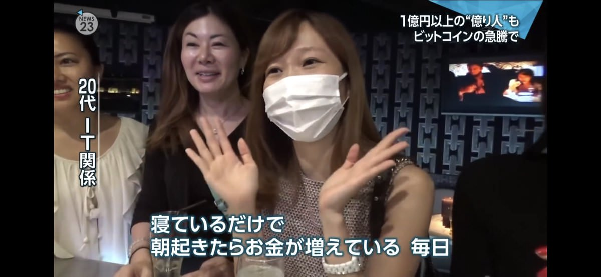

# BitcoinとWeb3と私とNostr

本テキストの初稿は[Yakihonne](https://yakihonne.com/article/naddr1qq2hgdfe09a9v3nhvae5jaz8v56yjepkvdm4yq3qm78s5eqv8l7snc5nnxdvlgue6pt5epgplndtem99quhwyptas7jsxpqqqp65w5c0e84)で公開したものです。バックアップとしてこちらにも加筆修正、保存しています

## はじめに
およその時間の前後は間違っていないと思いますが、正確な時期はかなりうろ覚えです（12/15に少し更新しました）
そのため、この文章は中年男性の誇大妄想の可能性があります。ご注意ください
また、わかる人が読んだら私が誰かわかる文章です。わかっても、あいつ暇なんだなとそっとしておいてあげてください

## Bitcoinとの出会いと別れ
私が初めてビットコインを所有したのは、コインチェック社（当時の社名はレジュプレス）との出会いがきっかけです。2012〜2014年の間だったと記憶しています

その頃の私の仕事はベンチャーキャピタル。それもシード〜アーリー期の投資家でした
ベンチャーキャピタルは、急成長するスタートアップに投資して、その会社の上場や買収によって利益を得るのが仕事です

伸びるスタートアップの条件はいろいろあれど、欠かせない要素は、事業が対象とする市場が伸びていること
当時はMt.GOXがハッキングされたニュースがテレビでも流れ、ビットコインはじめ仮想通貨（まだ暗号通貨と呼ばれていなかった頃）がイノベーター以降の層に知られ始めていく時期でした

テックビューロのZaifやビットフライヤーが成長するのを横目に、ビットコインの入り口になる取引所に投資したいと考えていた矢先、当時のCEO和田さんとお会いする機会があり、
それはプライベートの時間だったにも関わらず、図々しく仕事の話として、投資させて欲しいとお願いしました。和田さんには改めて感謝申し上げます

下っぱだった私に投資決定権限はなかったので、「コインチェックに投資すべき！なぜなら...」と、投資委員会に意思決定を迫る必要がありました
その準備の一貫で、コインチェックの口座を開き、少しドキドキしながらはじめてのビットコイン購入をします
投資委員会での審議の結果、投資は見送られることになり（その後のコインチェックは、ユニコーンどころかヤマタノオロチとも言うべき成長ぶり）、私の手元にはビットコインだけが残りました

私の無念をよそに、ビットコインの時価総額は成長を続け、「寝ているだけで、朝起きたらお金が増えている」という画像が出回るほど話題になります
ビットコインを保有している私の心中もお祭り騒ぎです

その後は大々的にニュースになったとおり、コインチェックで世界でも類を見ない規模のNEM（XEM）流出事件が起きました

事件当時はすでにVCからは離れていましたが、そこで新規事業を進める中、
暗号通貨取引所のOEM提供はないかと当時コインチェックの取締役であった大塚さんに相談した直後のこと
オフィス前に集まる人々やひたすら糾弾される記者会見など、よく覚えています

[ハードシングス真っ只中のコインチェック](https://logmi.jp/business/articles/260622)を応援していたものの、ビットコインの入り口になる取引所の脆弱さに失望したのも事実です
新幹線のトンネルや駅が簡単に崩れるとしたら、それはもう大動脈として成立しません
私は当時のポジションをすべて閉じ、日本円を出金して口座も閉鎖

それまでに十分に利益を確定できていたこともあり、なんの後悔もなくビットコインに別れを告げました

## Web3への期待と失望
およそ三年後、当時ニュージーランドにいた私は、とある若手起業家たちからの相談を受けます

Web3？DAO？スマートコントラクト？

VCからも暗号通貨からも離れていた私は、それまで全くキャッチアップしていなかった情報の咀嚼に手こずりながらも
それが未来に何をもたらすのかを考え、（その後、[Fracton Venturs](https://fracton.ventures/)を立ち上げる三人にはもちろん）彼らが人生を賭けようとしている仕組みに希望を覚えました

希望を呼び起こしたのは、「[幸福途上国ニッポン 〜新しい国に生まれかわるための提言〜](https://honto.jp/netstore/pd-review_0603415001.html)」の著者である目崎さんとお話した記憶です
（平日昼のお忙しい中、一時間以上も私にgiveし続けてくださった目崎さん。出国前に一度会うべきと目崎さんをご紹介してくださったKさん。本当にありがとうございます）

自主性と幸福度の相関関係は、所得と幸福度との相関より20倍もある

誰もが客観的に確認できて透明性が担保され、自動的に執行されるので公平さ（not平等）も担保されるであろうスマートコントラクト
それをルールとして、各々が自主的に組織に貢献していくDAO

住む国を変えることは容易ではない、よってもって生きる文化圏を変えることも容易ではない
でも、インターネットを通じてDAOに参加することで幸福を追求できるとしたら...？！

残念ながら、その後のWeb3は私の想像どおりにはなりませんでした
事例をいちいち挙げしませんが、私の結論は「人類にWeb3はまだ早い」

Web3とその周辺技術が、存在しない課題の解決を目指すのではなく、存在する課題の最適な解決手段になる日を
そして、DAOの理想が理想通り実現される日がいつかやってくることを願っています

## Into the rabbit hole
2021年3月、私は家族を残して一足先に日本に帰国します

家で一人、仕事以外の時間が暇。暇になるとやってしまうのがSNS。しかし、TwitterもFacebookもInstagramも、すでにレイトマジョリティが到着して、実世界と同じような空間になっていました

なんかないのかな？

そんなときに、分散型SNSである[Bluesky](https://bsky.app/)にWaitlist経由で運良く参加
イノベーターやアーリーアダプターだけの、初期Twitterのような空間を楽しんでいたところ、活発な人たちがNostrという何某について話をしているのが目につきました

彼ら彼女が発する[Nostr](https://nostr.com/)という単語を検索して知ったのは[Damus](https://damus.io/)というSNS
日本人がいるなら、こっちのSNSも覗いてみよう思ったのが運の尽き

転がり落ちた先で中華スパムの濁流に飲み込まれ、岸に引き上げられて今に至ります

## Bitcoinとの再会と期待の再燃
いくつもSNSがあるに関わらず、今はもうほとんどNostrに時間を費やしています

開発者ではない私がそんなにも時間を割くのは、イノベーターやアーリーアダプターしかいない心地良さも理由の一つですが、
Zapという仕組み（Zapでやりとりしているのは、ビットコイン。ここでビットコインと再会するとは！）と
ビットコインの上位レイヤーとしてのNostrに可能性を感じるからです

ビットコインの価値の源泉は、他の法定通貨と変わらず、人々からの信任です

仮想だ虚構だと批判する人もいますが、私にとってその価値は、VCが数社で決めるスタートアップの価値（しかも優先株も普通株も一緒にして計算している）よりもずっと最もらしく感じられ
また、国境を超えて多くの人々が信任していることに、まるで「人類の共通言語」のようなロマンを覚えます

Nostr上で行われている、価値と気持ちをZapに乗せてやりとりする様は、あえて他の事象で例えるならば、
（VCとして投資した）古き良きクラウドファンディングの、資本に気持ちを乗せたやりとりのようです

Nostrやビットコインの第三者に改変されにくい仕組みと、価値に気持ちを乗せたコミュニケーション、参加者それぞれが貢献していこうとするOSSの文化が相まって、
かつてWeb3・DAOに見た「自主的・主体的な行動とその結果としての幸福」という夢を、もう一度見せてもらっています

## 終わりに
帰りの電車でダラダラと考えたことを勢いで文章にしました

今はNostrに夢を見ていますが、半年後には失望しているかもしれませんし、もっとのめり込んでいるかもしれません
どうなるのかはわからないですが、わからないからこそ未来はいかようにも想像できるし、良くしようと関わることでまた違う楽しみがあります

まだ片手で数えるほどですが、Githubにアカウント登録してIssueをあげたり、もらったSatsを[OpenSats Nostr Fund](https://opensats.org/projects/nostr)に寄付したり...

来年はもう少しやれること・やれたことが増えるといいなと願っています。願うことができるなら、きっと動くこともできるでしょう
